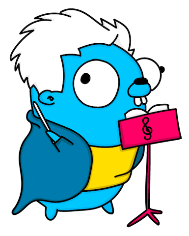

<p align="center">
  
</p>

# BandMaster  [](https://travis-ci.org/znly/bandmaster) [](https://coveralls.io/github/znly/bandmaster?branch=master) [](http://godoc.org/github.com/znly/bandmaster)

*Bandmaster* is a simple and easily extendable Go library for managing runtime dependencies such as reliance on external datastores, APIs, message-queues, etc.

*Bandmaster* is nothing extraordinary; it simply provides a stand-alone, fully tested & thread-safe package that implements some most-commonly needed features when dealing with 3rd-party clients, including but not limited to:
- automatic parallelization & synchronization of the initialization process
- dependency-tree semantics between services (i.e. service A depends on B & C which depends on B)
- configurable retries & exponential backoff when faced with initialization failures
- a global, thread-safe service registry so packages and goroutines can safely share clients
- idempotent start & stop methods
- a simple API to check whether a service is actually ready or not

*Bandmaster* comes with native support for some of the big names:
- Memcached via [rainycape/memcache](https://github.com/rainycape/memcache)
- Redis via [garyburd/redigo](https://github.com/garyburd/redigo)
- CQL-based datastores (e.g. Cassandra & ScyllaDB) via [gocql/gocql](https://github.com/gocql/gocql)
- SQL-based databases (e.g. PostgreSQL, MySQL...) via [jmoiron/sqlx](https://github.com/jmoiron/sqlx)
- NATS via [nats-io/go-nats](https://github.com/nats-io/go-nats)
- Kafka via [bsm/sarama-cluster](https://github.com/bsm/sarama-cluster)

In addition to these standard implementations, *Bandmaster* provides a straightforward extension API so you can easily implement your own services; see [this section](#implementing-a-custom-service) for more details.

*Bandmaster* is all about starting, exposing and stopping services; it doesn't cover configuration nor does it care about what happens to a service during its lifetime.

---

**Table of Contents:**  
<!-- START doctoc generated TOC please keep comment here to allow auto update -->
<!-- DON'T EDIT THIS SECTION, INSTEAD RE-RUN doctoc TO UPDATE -->


- [Usage](#usage)
  - [Quickstart](#quickstart)
  - [Implementing a custom service](#implementing-a-custom-service)
  - [Error handling](#error-handling)
  - [Logging](#logging)
- [Contributing](#contributing)
  - [Running tests](#running-tests)
- [Authors](#authors)
- [License](#license-)

<!-- END doctoc generated TOC please keep comment here to allow auto update -->

## Usage

### Quickstart

### Implementing a custom service

### Error handling

*Bandmaster* uses the [`pkg/errors`](https://github.com/pkg/errors) package to handle error propagation throughout the call stack; please take a look at the related documentation for more information on how to properly handle these errors.

### Logging

*Bandmaster* does some logging whenever a service or one of its dependency undergoes a change of state; for that, it uses the global logger from Uber's [*Zap*](https://github.com/uber-go/zap) package.  
You can thus control the behavior of *Bandmaster*'s logger however you like by calling [`zap.ReplaceGlobals`](https://godoc.org/go.uber.org/zap#ReplaceGlobals) at your convenience.

For more information, see *Zap*'s [documentation](https://godoc.org/go.uber.org/zap).

## Contributing

Contributions of any kind are welcome; whether it is to fix a bug, clarify some documentation/comments or simply correct english mistakes and typos: do feel free to send us a pull request.

*Bandmaster* is pretty-much frozen in terms of features; if you still find it to be lacking something, please file an issue to discuss it first.  
Also, do not hesitate to open an issue if some piece of documentation looks either unclear or incomplete to you, nay is just missing entirely.

*Code contributions must be thoroughly tested and documented.*

### Running tests

```sh
$ docker-compose -f test/docker-compose.yml up
$ ## wait for the datastores to be up & running, then
$ make test
```

## Authors

See [AUTHORS](./AUTHORS) for the list of contributors.

## License 

The Apache License version 2.0 (Apache2) - see [LICENSE](./LICENSE) for more details.

Copyright (c) 2017	Zenly	<hello@zen.ly> [@zenlyapp](https://twitter.com/zenlyapp)
